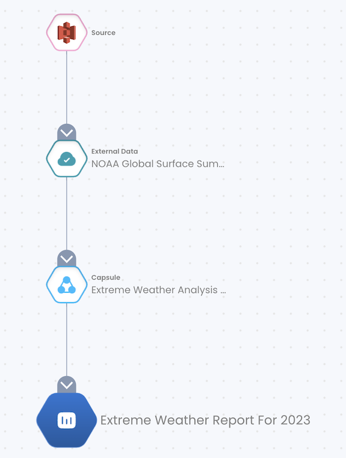

# Extreme Weather Analysis with PySpark and EMR Serverless

This capsule runs a PySpark job on EMR Serverless that analyzes data from the NOAA Global Surface Summary of Day dataset from the Registry of Open Data on AWS.

extreme_weather.py analyzes data from the current year and finds the weather location with the most extreme rain, wind, snow, and temperature.

By running the Spark job from a Code Ocean Capsule, we maintain provenance of the analysis that would otherwise be lost. The following screenshot shows the lineage of a result generated by this capsule which captures all the components involved in producing the result and gaurantees its reproducibility. 

## Secrets

This capsule requires two secrets attached in the environment editor. 

1. AWS Cloud Credentials or an Assumable Role: AWS credentials which grant read and write access to the S3 bucket specified in the App Panel. 
2. Custom Key: Job role ARN for EMR access (at least EMR Serverless) 

This capsule was built off the example provided here: 
https://github.com/aws-samples/emr-serverless-samples/tree/main/examples/pyspark

## Input Data

Weather data from the **NOAA Global Surface Summary of Day** open data bucket (s3://noaa-gsod-pds/)

## Output Data

**output_weather_report.txt**: text file containing extreme weather stats from the current year such as the highest temperature, the most precepitation, and the corresponding locations. 

**output**: Console output from the run.

## App Panel Parameters

S3 Bucket
- This will be the entry point for the Spark job, storage for intermediate files, and storage for Spark logs. 

Name of Spark Job
- The name of the EMR Serverless Spark Job 

[Code Ocean](https://codeocean.com/) is a cloud-based computational platform that aims to make it easy for researchers to share, discover, and run code.  
